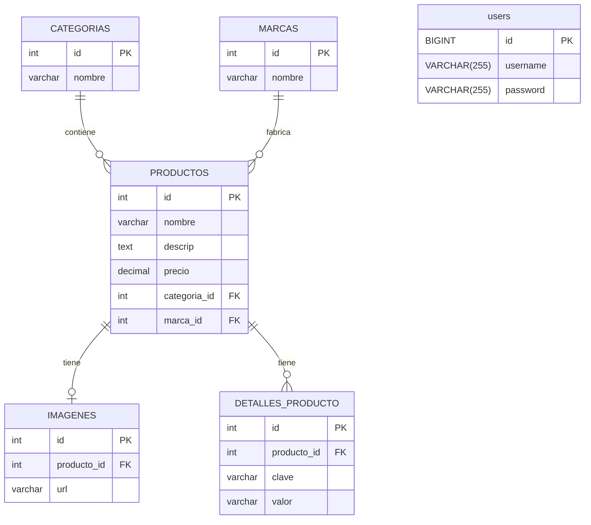

```sql
CREATE DATABASE IF NOT EXISTS scodify_profitstore;

USE scodify_profitstore;

-- Crear la tabla categorias
CREATE TABLE categorias (
    id INT AUTO_INCREMENT PRIMARY KEY,
    nombre VARCHAR(255) NOT NULL
);

-- Crear la tabla marcas
CREATE TABLE marcas (
    id INT AUTO_INCREMENT PRIMARY KEY,
    nombre VARCHAR(255) NOT NULL
);

-- Crear la tabla productos
CREATE TABLE productos (
    id INT AUTO_INCREMENT PRIMARY KEY,
    nombre VARCHAR(255) NOT NULL,
    descrip TEXT,
    precio DECIMAL(10, 2) NOT NULL,
    categoria_id INT,
    marca_id INT,
    FOREIGN KEY (categoria_id) REFERENCES categorias(id),
    FOREIGN KEY (marca_id) REFERENCES marcas(id)
);

-- Crear la tabla imagenes
CREATE TABLE imagenes (
    id INT AUTO_INCREMENT PRIMARY KEY,
    producto_id INT,
    url VARCHAR(255) NOT NULL,
    FOREIGN KEY (producto_id) REFERENCES productos(id)
);

-- Crear la tabla detalles_producto
CREATE TABLE detalles_producto (
    id INT AUTO_INCREMENT PRIMARY KEY,
    producto_id INT,
    clave VARCHAR(255) NOT NULL,
    valor VARCHAR(255) NOT NULL,
    FOREIGN KEY (producto_id) REFERENCES productos(id)
);

CREATE TABLE users (
    id BIGINT PRIMARY KEY,
    username VARCHAR(255) NOT NULL UNIQUE,
    password VARCHAR(255) NOT NULL
);

-- Insertar categorías
INSERT INTO categorias (nombre) VALUES 
('Ropa'),
('Accesorios');

-- Insertar marcas
INSERT INTO marcas (nombre) VALUES 
('Nike'),
('Adidas');

-- Insertar productos
INSERT INTO productos (nombre, descrip, precio, categoria_id, marca_id) VALUES 
('Camiseta Deportiva', 'Camiseta transpirable para entrenamientos intensos.', 25.99, 1, 1),
('Pantalones Cortos', 'Pantalones cortos cómodos y ligeros.', 29.99, 1, 2),
('Botella de Agua', 'Botella de agua reutilizable de acero inoxidable.', 15.50, 2, 1),
('Muñequeras', 'Muñequeras absorbentes para mayor comodidad.', 12.00, 2, 2),
('Zapatillas de Entrenamiento', 'Zapatillas diseñadas para un mejor rendimiento.', 79.99, 1, 1);

-- Insertar imágenes
INSERT INTO imagenes (producto_id, url) VALUES 
(1, 'http://example.com/images/camiseta_deportiva.jpg'),
(2, 'http://example.com/images/pantalones_cortos.jpg'),
(3, 'http://example.com/images/botella_agua.jpg'),
(4, 'http://example.com/images/muñequeras.jpg'),
(5, 'http://example.com/images/zapatillas_entrenamiento.jpg');

-- Insertar detalles del producto
INSERT INTO detalles_producto (producto_id, clave, valor) VALUES 
(1, 'tamaño', 'M'),
(1, 'color', 'Negro'),
(2, 'tamaño', 'L'),
(2, 'color', 'Azul'),
(3, 'capacidad', '750ml'),
(4, 'material', 'Algodón'),
(5, 'tamaño', '42'),
(5, 'color', 'Blanco');
```