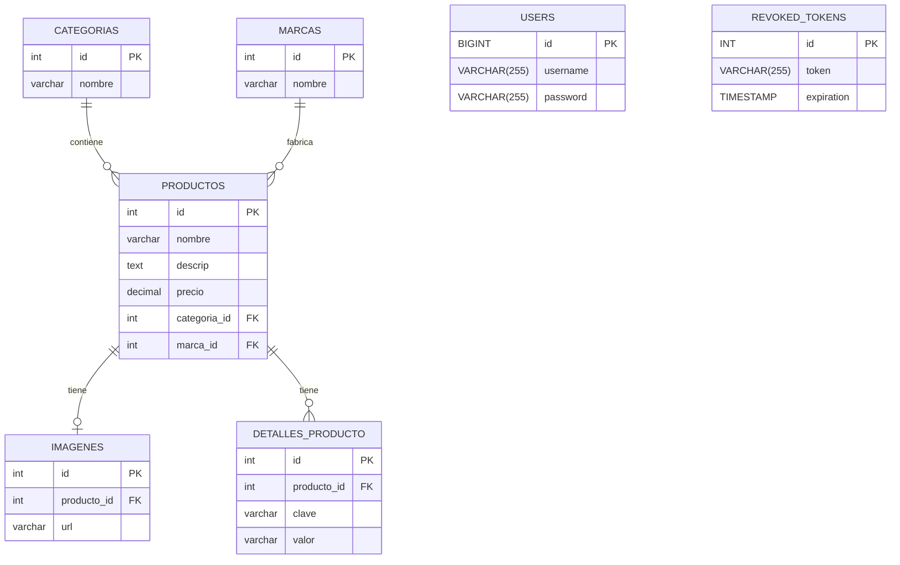

```sql
CREATE DATABASE IF NOT EXISTS scodify_profitstore;

USE scodify_profitstore;

CREATE TABLE categorias (
    id INT AUTO_INCREMENT PRIMARY KEY,
    nombre VARCHAR(255) NOT NULL
);

CREATE TABLE marcas (
    id INT AUTO_INCREMENT PRIMARY KEY,
    nombre VARCHAR(255) NOT NULL
);

CREATE TABLE productos (
    id INT AUTO_INCREMENT PRIMARY KEY,
    nombre VARCHAR(255) NOT NULL,
    descrip TEXT,
    precio DECIMAL(10, 2) NOT NULL,
    categoria_id INT,
    marca_id INT,
    FOREIGN KEY (categoria_id) REFERENCES categorias(id),
    FOREIGN KEY (marca_id) REFERENCES marcas(id)
);

CREATE TABLE imagenes (
    id INT AUTO_INCREMENT PRIMARY KEY,
    producto_id INT,
    url VARCHAR(255) NOT NULL,
    FOREIGN KEY (producto_id) REFERENCES productos(id)
);

CREATE TABLE detalles_producto (
    id INT AUTO_INCREMENT PRIMARY KEY,
    producto_id INT,
    clave VARCHAR(255) NOT NULL,
    valor VARCHAR(255) NOT NULL,
    FOREIGN KEY (producto_id) REFERENCES productos(id)
);

CREATE TABLE users (
    id BIGINT PRIMARY KEY,
    username VARCHAR(255) NOT NULL UNIQUE,
    password VARCHAR(255) NOT NULL
);

INSERT INTO categorias (nombre) VALUES 
('Ropa'),
('Accesorios');

INSERT INTO marcas (nombre) VALUES 
('Nike'),
('Adidas');

INSERT INTO productos (nombre, descrip, precio, categoria_id, marca_id) VALUES 
('Camiseta Deportiva', 'Camiseta transpirable para entrenamientos intensos.', 25.99, 1, 1),
('Pantalones Cortos', 'Pantalones cortos cómodos y ligeros.', 29.99, 1, 2),
('Botella de Agua', 'Botella de agua reutilizable de acero inoxidable.', 15.50, 2, 1),
('Muñequeras', 'Muñequeras absorbentes para mayor comodidad.', 12.00, 2, 2),
('Zapatillas de Entrenamiento', 'Zapatillas diseñadas para un mejor rendimiento.', 79.99, 1, 1);

INSERT INTO detalles_producto (producto_id, clave, valor) VALUES 
(1, 'tamaño', 'M'),
(1, 'color', 'Negro'),
(2, 'tamaño', 'L'),
(2, 'color', 'Azul'),
(3, 'capacidad', '750ml'),
(4, 'material', 'Algodón'),
(5, 'tamaño', '42'),
(5, 'color', 'Blanco');
```